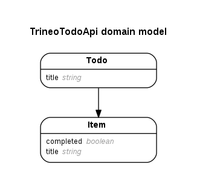

Trineo Todo API
===============

This is the Trineo Todo API.  To get started:

```
$ rake db:setup
$ rake spec
```

The API is quite simple, it represents Todos, and each Todo has many items



Feature requests
----------------

The following new features have been requested for the API:

- **Add completed flag to Todos** - add a new `completed` boolean flag to the
  JSON representation of a `Todo`.  A `Todo` is considered to be completed when
  all of it's `Item`s are completed.  If a `Todo` has no `Item`s, it should
  be considered *not* completed.
